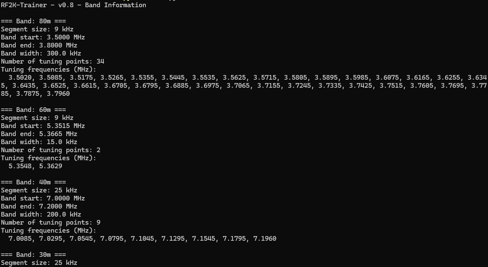
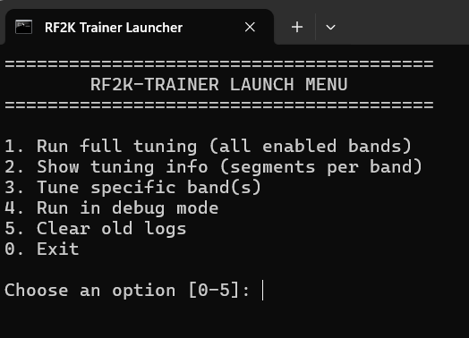

# RF2K TRAINER

## Quick Start — Windows EXE (no Python, no Git)
> **Recommended for most users (Windows 10/11, 64‑bit).**  
> No Python, no Git, no developer tools required.

**Before you begin:** please skim **all steps A–G** once. On first run, Windows **SmartScreen** may show “Windows protected your PC.” This is expected (the binary is currently **unsigned**). See **Step E** for what to click.


### A. Download
1. Open your web browser (Edge, Chrome, Firefox, Opera — anything is fine).
2. Go to the project **Releases** page:  
   https://github.com/tnxqso/rf2k-trainer/releases/latest
3. Scroll to **Assets** and click the file named **`rf2k-trainer_*_win64.zip`** to download it.
4. When the browser asks where to save, choose **Downloads**. If it downloads automatically, that's fine.

> **NOTE:** The release ZIP is **flat** — it does **not** contain a parent folder. You will see files like `rf2k-trainer.exe`, `rf2k-trainer.bat`, and `settings.example.yml` at the top level. Create a folder first so everything stays together.

### B. Create the install folder
1. Press **Windows + E** to open **File Explorer**.
2. In the left sidebar, click **Downloads**.
3. Right‑click the downloaded ZIP file → click **Extract All…**.
4. In the dialog, click **Browse…**. In the folder list:
   - Click your **user name** (for example, **Steve**).
   - Click **New folder** and name it **rf2k-trainer**.
   - Click **Select Folder**, then click **Extract**.
   > Alternative: in the “Files will be extracted to this folder” box, you can paste: `%USERPROFILE%\rf2k-trainer`

### C. First run
1. After extraction, the **rf2k-trainer** folder opens.
2. Double‑click **`rf2k-trainer.bat`** (menu launcher).
3. On first run it will **create `settings.yml`** for you and offer to open it in **Notepad**.
4. Click **Yes** to open **Notepad** and edit your settings:
   - **FlexRadio** users: set your radio’s IP in `radio.host` (port is usually `4992`). Leave `type: flex`.
   - **Hamlib rigctl** users: set `radio.type: rigctl` and **`rigctld_model`** (Hamlib model number). You may also set `rigctld_path` if Hamlib is not in PATH. The trainer can start `rigctld` automatically.
5. Save the file in Notepad (**Ctrl+S**) and close Notepad. Return to the launcher window and press a key to continue.

### D. Use the menu
- **1)** Run full tuning (all enabled bands)  
- **2)** Show tuning info only (`--info`)  
- **3)** Tune specific band(s) (example: `20 40 60m`)  
- **4)** Run in debug mode (adds `--debug`)  
- **5)** Clear old logs (`--clear-logs`)  

### E. SmartScreen (first run warning)
If Windows shows **“Windows protected your PC”**:
1. Click **More info**.
2. Click **Run anyway**.

### F. Upgrade later
1. Close the trainer.
2. Download the new **`rf2k-trainer_*_win64.zip`** from **Releases**.
3. Open your folder **`%USERPROFILE%\rf2k-trainer`** in **File Explorer**.
4. Copy the new **`rf2k-trainer.exe`** (and the `.bat` if updated) over the old one(s). **Do not delete `settings.yml` or `logs\`.**

### G. Where to find logs
- Logs are written to the **`logs\`** subfolder. Include them if you ask for help.


## Table of Contents

- [Why RF2K-TRAINER Exists](#why-rf2k-trainer-exists)
- [Introduction](#introduction)
- [Features](#features)
- [Supported Radios](#supported-radios)
- [Requirements](#requirements)
- [Installation & Configuration](#installation--configuration)
  - [General Requirements (All Platforms)](#️-general-requirements-all-platforms)
  - [Windows Installation (Step-by-step)](#-windows-installation-step-by-step)
  - [Linux / macOS Installation](#-linux--macos-installation)
  - [Configuration Overview](#️-configuration-overview)
  - [Example `radio:` Settings](#example-radio-settings)
  - [Setting Your IARU Region](#setting-your-iaru-region)
- [Usage](#usage)
  - [Examples](#examples)
  - [Arguments](#arguments)
  - [Full automatic tuning](#full-automatic-tuning)
  - [Tuning a single band](#tuning-a-single-band)
  - [Show band segments info without tuning](#show-band-segments-info-without-tuning)
  - [Recommended First Step](#recommended-first-step)
- [Real-World Tuning Time (Example)](#real-world-tuning-time-example)
- [Band Plan Overrides](#band-plan-overrides)
- [Windows Launcher Script (Optional)](#windows-launcher-script-optional)
  - [Create a Desktop Shortcut](#create-a-desktop-shortcut)
- [Debugging and Troubleshooting](#debugging-and-troubleshooting)
- [Upgrade Instructions](#upgrade-instructions)
- [Contributing](#contributing)
  - [How to Contribute](#how-to-contribute)
  - [How to Submit a Pull Request](#how-to-submit-a-pull-request)
  - [Code Style and Practices](#code-style-and-practices)
- [Project Independence](#project-independence)
- [License](#license)
- [Acknowledgments](#acknowledgments)
- [API Note: "Tune & Store"](#api-note-tune--store)
- [Useful Resources](#useful-resources)
- [Installing Hamlib (rigctl)](#installing-hamlib-rigctl)
- [Disclaimer](#disclaimer)

---

## Why RF2K-TRAINER Exists

The RF2K-S HF Power Amplifier requires tuning to be performed and stored for every fixed frequency segment across the HF bands. This design makes sense, once tuned, the amplifier will instantly recall the correct match whenever you're back on that frequency. But the process of populating all segments can be painfully repetitive.

If you've installed a new antenna, changed coax length, or moved the station, chances are you'll need to re-tune every band. That means:

- Manually setting your transceiver to multiple dozen center frequencies
- Transmitting a low-power carrier (typically in CW or RTTY)
- Pressing "Tune & Store" on the amplifier
- Repeating this for every segment of every band you care about

It's easy to lose track of where you were, or forget to tune the segments near the band edges. Even if you're organized, this is a time-consuming and error-prone process.

**RF2K-TRAINER solves this** by automating the *radio side* of the process: stepping through all relevant frequencies based on the IARU band plan, calculating exact segment centers as defined in the amplifier (not just approximate steps), and letting the operator focus on confirming that it's safe to tune.

You stay in control – the program waits for your confirmation after each step – but all the manual work with frequency dials and checklists is gone.

This tool is especially useful if:
- You want complete tuning coverage for all bands of interest
- You’ve made changes to antennas or operating location
- You want to save time while still respecting operating practices

RF2K-TRAINER works with both FlexRadio (via native API) and other transceivers via Hamlib (`rigctl`). With FlexRadio, drive power can also be set automatically, otherwise you'll be prompted to do it manually before starting.

No shortcuts, no blind transmissions – just a smarter way to handle a tedious job.

## Introduction

**RF2K-TRAINER** is a command-line utility that automates the frequency stepping and guidance required to tune the **RF2K-S HF Power Amplifier** across its fixed segment architecture.

Based on IARU band plans (Region 1, 2, or 3), it calculates the exact center frequencies used for memory storage in the amplifier and walks the operator through each tuning step with minimal risk of error.

The tool communicates directly with your transceiver (FlexRadio or Hamlib-compatible) and optionally with the RF2K-S HF Power Amplifier itself (to some extent), logging every step and ensuring tuning sessions are repeatable and complete.

It’s a controlled, deterministic approach that reduces guesswork, while still keeping you in charge of transmission and safety.

---

## Features

- Supports both **FlexRadio** (via native TCP API) and **Hamlib-compatible radios** (via `rigctld`)
- Automatically connects to FlexRadio or rigctld based on configuration
- Fetches and validates band segment limits from IARU band plans
- Supports IARU Region 1, 2 and 3 via `iaru_region_X.yml` files
- Allows per-band power and limit overrides in `settings.yml`
- Connects to RF2K-S HF Power Amplifier over HTTP to read status and switch to STANDBY mode
- Calculates segment midpoints and detects edge gaps
- Fully interactive loop for tuning each segment per band
- Safety validation for drive power and frequency settings
- Calculates tuning points at segment centers for optimal segment coverage
- Supports RF2K-S HF Power Amplifier fixed tuning segments
- Detects and tunes sub-segment gaps at band edges
- Logs debug output and tuner data to separate files in the `logs/` directory


## Supported Radios

`rf2k-trainer` supports the following radio control interfaces:

- **FlexRadio** via native TCP/IP API (tested)
- **Hamlib (rigctl)** for other radios supporting CAT via rigctld (experimental)

> ⚠️ When using `rigctl`, drive power cannot be automatically set by this program. You must manually ensure your transceiver outputs the correct `drive_power` during tuning steps.

See [Installing Hamlib (rigctl)](#installing-hamlib-rigctl) below for setup instructions.

## Requirements

- Python 3.10+
- A supported transceiver:
  - **FlexRadio** (e.g. FLEX-6000 series) with SmartSDR TCP API, or
  - Any radio supported by **Hamlib** via `rigctld` (experimental support)
- RF2K-S HF Power Amplifier (optional) with web API enabled (version 0.9 or later)

---


## Installation & Configuration

This section guides you through installing RF2K-TRAINER and preparing your system to communicate with your radio and amplifier.

---

### ⚙️ General Requirements (All Platforms)

Before proceeding, ensure the following tools are installed:

- Python **3.10 or later**  
  [Download Python](https://www.python.org/downloads/)

- `pip` – Python package manager (usually included with Python)

- Git – used to clone the repository  
  [Download Git](https://git-scm.com/downloads)  
  ✅ During setup on Windows, choose the option:  
  **"Git from the command line and also from 3rd-party software"**

- **Hamlib** – Required if you are **not using FlexRadio**  
  [Download Hamlib from SourceForge](https://sourceforge.net/projects/hamlib/)

---


### 🪟 Windows Installation (Step-by-step)

If you're new to Python or Git, follow each step carefully:

#### 1. Install Git  
[https://git-scm.com/downloads](https://git-scm.com/downloads)

#### 2. Install Python 3.10+  
[https://www.python.org/downloads/](https://www.python.org/downloads/)  
✅ Check **"Add Python to PATH"** during installation

#### 3. (Optional) Install Hamlib (for non Flexradio users)  
FlexRadio users can skip this step.

- Download the Windows installer from:  
  [`Hamlib on SourceForge`](https://sourceforge.net/projects/hamlib/files/hamlib/)  
  Example file: `hamlib-w64-4.6.4.exe` (version may vary)

- Run the installer and accept the default installation folder, typically:  
  ```
  C:\Program Files\hamlib-w64-4.6.4
  ```

- ⚠️ Take note of this installation path — you’ll need to copy it into your `settings.yml` file.

  Example:
  ```yaml
  radio:
    type: rigctl
    auto_start_rigctld: true
    rigctld_path: "C:\Program Files\hamlib-w64-4.6.4\bin\rigctld.exe"
    model: 3073 # For Icom IC-7300
    serial_port: COM4
  ```

- ℹ️ `rigctl.exe` will automatically be discovered in the same folder as `rigctld.exe`, no need to configure it separately.

> 📝 The file `README.w64-bin.txt` in the Hamlib installation directory contains extra instructions and troubleshooting notes specific to Windows users.

#### 4. Open PowerShell  
Press `Windows + R`, type `powershell`, press Enter

#### 5. Clone the Repository
```powershell
git clone https://github.com/tnxqso/rf2k-trainer.git
cd rf2k-trainer
```

#### 6. Install Python Dependencies
```powershell
pip install -r requirements.txt
```

#### 7. Create and Edit Configuration
```powershell
copy settings.example.yml settings.yml
notepad settings.yml
```
Then edit `settings.yml` to define:
- IARU region (1, 2, or 3)
- Radio type (`flex` or `rigctl`)
- IP or COM settings
- Enabled bands and drive power

---

### 🐧 Linux / macOS Installation

1. **Clone the Repository**
   ```bash
   git clone https://github.com/tnxqso/rf2k-trainer.git
   cd rf2k-trainer
   ```

2. **Install Python Dependencies**
   ```bash
   pip install -r requirements.txt
   ```

3. **Create and Edit Configuration**
   ```bash
   cp settings.example.yml settings.yml
   nano settings.yml
   ```

---

### ⚙️ Configuration Overview

All configuration is done via a single file: `settings.yml`

- Defines your IARU region
- Selects which bands to tune
- Sets drive power per band (FlexRadio only)
- Configures radio interface (FlexRadio or Hamlib rigctl)
- Sets amplifier connection (RF2K-S HF Power Amplifier via HTTP)

⚠️ Do not modify other `.yml` files — they are used internally by the program.

---

### Example `radio:` Settings

#### ✅ FlexRadio
```yaml
radio:
  type: flex
  host: 192.168.20.100
  port: 4992
```

#### 🛠️ Hamlib / rigctl
```yaml
radio:
  type: rigctl
  auto_start_rigctld: true
  rigctld_path: "/usr/local/bin/rigctld"
  model: 3073  # For Icom IC-7300
  serial_port: "/dev/ttyUSB0"
```

> ⚠️ **Important Note:** When using `rigctl`, `tuning_power` **cannot be set automatically**. You must manually configure power level on your radio before tuning.

---

### Setting Your IARU Region

In `settings.yml`:
```yaml
defaults:
  iaru_region: 1
```

You may override `band_start`, `band_end`, and `drive_power` per band if needed — but be cautious when overriding band limits unless you understand the implications.

---

## Usage

```bash
python main.py [bands ...] [--debug] [--info] [--clear-logs]
```

### Examples

```bash
python main.py 20 40
python main.py 80m 160m --debug
python main.py --clear-logs
python main.py --info
```

### Arguments

- `bands` – One or more bands to tune (e.g., `20`, `40m`, `160m`). If omitted, all enabled bands from `settings.yml` are used.
- `--debug` – Enables debug logging
- `--info` – Shows band tuning info without performing tuning
- `--clear-logs` – Deletes old logs and exits program
- `--help` – Shows usage help
- `--version` – Displays program version

## Full automatic tuning

```bash
python main.py
```

This runs interactive mode for all enabled bands.

### Tuning a single band

```bash
python main.py 20
python main.py 40m
```

Only tunes that band if it's enabled.

### Show band segments info without tuning

```bash
python main.py --info
```

---

### Recommended First Step

```bash
python main.py --info
```

This verifies that all segment alignment and tuning parameters are correct before tuning.




---

## Real-World Tuning Time (Example)

> 💡 Curious how long the tuning process takes?

In a real-world test, tuning all enabled bands **except 160m** and **only the lower half of 6m**, took **approximately 18 minutes**.  
This included several retunes on certain frequencies, since occasionally a second tuning pass produced better SWR results.

This is a representative example using a FlexRadio and RF2K-S HF Power Amplifier combo with segment logging enabled.

---


## Band Plan Overrides

You **can** override `band_start`, `band_end`, and `drive_power` for each band in your `settings.yml` file —  
however, changing `band_start` and `band_end` is **not recommended** unless you fully understand the implications.

> ⚠️ Note: `drive_power` settings only apply when using **FlexRadio**.  
> If you're using `rigctl`, you must manually configure your radio’s output power before tuning.

These values affect how tuning points are calculated, and improper overrides may result in incomplete coverage or inefficient tuning. Proceed with caution.

### Important:

The RF2K-S HF Power Amplifier uses **fixed frequency segments** for storing tuning data. These segment sizes and their exact center frequencies are hardcoded in the amplifier firmware and cannot be changed.

- Each band has a defined `segment_size` (e.g. 9 kHz on 80m) and a known `first_segment_center`.
- These segment centers **rarely align with the official IARU band edges**, but this tool calculates the optimal center-aligned tuning points automatically – no manual adjustment needed.
- You do **not** need to align `band_start` or `band_end` to any specific step or grid.

> **Why center tuning matters:**  
> RF2K-S HF Power Amplifier stores one tuning memory per segment. Tuning off-center may result in suboptimal coverage, and any new tuning within the same segment will overwrite previous values. This tool always tunes at the exact center of each segment to ensure best coverage and minimal conflicts.


### Example: 6m band from IARU file

```yaml
6m:
  band_start: 50000
  band_end: 52000
```

If you need to limit the band range, you may do so in `settings.yml`. A valid override could be:

```yaml
6m:
  enabled: true
  band_start: 50100
  band_end: 51900     # Any value >= band_start at least one segment size
```

### Summary

- `drive_power` is safe to override per band.
- `band_end` must be at least a segment size larger than `band_start`.
- You are on your own if you override these. Make sure you understand what you're doing or you risk incomplete or incorrect tuning coverage.


---


## Windows Launcher Script (Optional)


To simplify usage for less technical users, RF2K-TRAINER includes a ready-to-use `.bat` launcher script that presents a text-based menu of common options:



This script allows users to interact with RF2K-TRAINER without typing commands manually.

### Create a Desktop Shortcut

You may create a shortcut to the launcher for easier access:

1. Locate the `rf2k-trainer.bat` file inside your `rf2k-trainer` folder (typically under `C:\Users\YourName\rf2k-trainer`)
2. Right-click the file and choose **Send to → Desktop (create shortcut)**
3. (Optional) Right-click the new shortcut and choose **Properties**
   - Under the **Shortcut** tab, you may choose **Change Icon** to give it a custom look
   - You can also set it to **Run: Minimized** if preferred
4. Double-click the icon to launch RF2K-TRAINER

This is the recommended way to run RF2K-TRAINER on Windows for casual users.


## Debugging and Troubleshooting

- Check your radio connection settings in `settings.yml`:
  - For **FlexRadio**, verify the correct IP address and port (default: `4992`)
  - For **rigctl**, confirm that `rigctld` is running and listening on the correct port

- If using **FlexRadio**, make sure only one SmartSDR client is connected at a time.

- Confirm that your **RF2K-S** amplifier is reachable on the network and running API version **0.9** or later.

- Run the tool in debug mode to see detailed output:

  ```bash
  python main.py --debug
  ```

  This enables verbose logging and can help identify misconfigurations or communication issues.

- All logs are saved automatically in the `logs/` directory:
  - **Debug logs** (general program output):  
    `logs/rf2k-trainer_<timestamp>.log`
  - **Tuner logs** (tuning results per segment):  
    `logs/tuning-results_<timestamp>.csv`

> 💡 If you're requesting support or reporting a bug, include both log files.  
> They are essential for reproducing and diagnosing problems.

## Upgrade Instructions

To upgrade RF2K-TRAINER to the latest version:

1. Pull the latest version from GitHub (or copy new files manually):
   ```bash
   git pull origin main
   ```

2. If dependencies have changed (check `requirements.txt`), update them:
   ```bash
   pip install -r requirements.txt
   ```

3. (Optional) Backup your YAML configuration file:
   - `settings.yml`

4. Run the program as usual:
   ```bash
   python main.py --info
   ```

> Tip: See [`CHANGELOG.MD`](./CHANGELOG.MD) for specific upgrade notes or breaking changes.

## Contributing

We welcome contributions from radio amateurs, developers, and testers of all experience levels.

### How to Contribute

There are several ways you can help improve this project:

- 🐞 **Report Bugs:** Found a bug or something not working as expected? Please open an issue describing the problem in detail.
- 💡 **Suggest Enhancements:** Have an idea for a new feature or improvement? We'd love to hear it — open a feature request on GitHub.
- 🧪 **Test and Validate:** Try the software with your own FlexRadio or RF2K-S HF Power Amplifier setup. Let us know what works, what doesn't, and where things can be improved.
- 🔧 **Contribute Code:** Found a bug and fixed it? Want to add support for more radios or features? Fork the repository and submit a pull request.
- 📚 **Improve Documentation:** Typos, clarifications, or new explanations are always welcome. Good documentation helps everyone.

### How to Submit a Pull Request

1. **Fork the repository** to your GitHub account.
2. **Clone your fork** locally:
   ```bash
   git clone https://github.com/YOUR_USERNAME/rf2k-trainer.git
   cd rf2k-trainer
   ```
3. **Create a new branch** for your changes:
   ```bash
   git checkout -b my-feature
   ```
4. **Make your changes** and commit:
   ```bash
   git commit -am "Add my feature"
   ```
5. **Push your changes** to your fork:
   ```bash
   git push origin my-feature
   ```
6. **Open a pull request** on the main repository.

### Code Style and Practices

- Follow Python best practices and PEP8 style guidelines.
- Add docstrings and comments to explain non-obvious code.
- Test your changes thoroughly before submitting.
- Keep pull requests focused — small, targeted improvements are easier to review.

---

We're grateful for every contribution, large or small. Your help makes this project better for everyone!

---

## Project Independence

RF2K-TRAINER is an independent open-source project created by and for the amateur radio community.

This project is **not affiliated with**, **endorsed by**, or **officially supported by** RF-KIT, RF-POWER, FlexRadio Systems, or the Hamlib project.  
All product names and trademarks mentioned are the property of their respective owners and are used strictly for interoperability and reference purposes.

And yes — this software is completely **free**. We don’t want your money, beer, or even coffee.  
(Okay, we *like* coffee and red wine but the best way to show appreciation is to use the tool, share feedback, or tell a fellow ham about it!)


## License

RF2K-TRAINER is released under the [MIT License](https://opensource.org/licenses/MIT).  
You are free to use, copy, modify, and distribute the software, as long as the original license and copyright notice remain.

---

## Acknowledgments

- [FlexRadio Systems](https://www.flexradio.com/)
- [RF-Power RF2K-S](https://rf-kit.de/)
- [Hamlib Project](https://hamlib.github.io/) — for providing rig control support across many transceivers
- Contributors to SmartSDR, RFKit API, and amateur radio open source tools

---

## API Note: "Tune & Store"

Currently, the RF2K-S HF Power Amplifier requires **manual activation** of the **"Tune & Store"** function on the front panel during each tuning step.  
Unfortunately, the [RFKit API (v0.9)](https://rf-power.eu/wp-content/uploads/2024/12/RFKIT_api_doc_0_9_0.html) does **not** offer any way to trigger this action remotely or programmatically.

A formal feature request has been submitted to the RF-Kit development team to enable this capability via the API.  
We remain hopeful that a future firmware release will add support for fully automated tuning workflows — including remote activation of **"Tune & Store"** and a response indicating when tuning has completed and been stored.

> Note: In practice, a single tuning pass often yields acceptable results, but occasionally a second pass improves performance.  
> While some users prefer full manual control, a hybrid approach — automatic first, manual fine-tuning if needed — could offer the best of both worlds.

---
## Useful Resources

Here are some useful links and documentation references that may assist with integration, troubleshooting, and further development:

- 📘 [RFKIT API and SDK Documentation](https://rf-power.eu/wp-content/uploads/2024/12/RFKIT_api_doc_0_9_0.html)  
  Official API documentation for RF2K-S HF Power Amplifier control (v0.9)

- 📖 [RF2K-S User Manual (June 2025)](https://rf-power.eu/wp-content/uploads/2025/06/RF2K-S_User_Manual_EN_06_25.pdf)  
  Latest user manual for RF2K-S HF Power Amplifier, including front panel operation and memory concepts

- 🧠 [SmartSDR TCPIP API (FlexRadio)](https://github.com/flexradio/smartsdr-api-docs/wiki/SmartSDR-TCPIP-API)  
  Unofficial documentation of the FlexRadio TCP/IP API (used for CAT control)

- 🔧 [Hamlib rigctl Manual (CLI Reference)](https://manpages.debian.org/testing/hamlib-utils/rigctl.1.en.html)  
  Command-line usage and supported functionality for Hamlib's `rigctl` interface

- 📡 [Hamlib GitHub Repository](https://github.com/Hamlib/Hamlib)  
  Source code, issues, and contributions to the Hamlib library

- 📝 [IARU Band Plans (Region 1)](https://www.iaru-r1.org/band-plans/)  
  Official regional band plan references (Region 1 shown — others available)

- 🛠️ [SDR Command Line Tools](https://github.com/dl1ksv/smartsdr-cli)  
  Tools and inspiration for controlling FlexRadio via scripts


- 🛠️ [rigctl - Man Page](https://www.mankier.com/1/rigctl)  
  Control radio transceivers and receivers. rigctl accepts commands from the command line as well as in interactive mode if none are provided on the command line.

If you know of other valuable resources that should be listed here, feel free to submit a pull request or open an issue!

## Installing Hamlib (rigctl)

If you're not using a FlexRadio, `RF2K Trainer` supports other radios through Hamlib's `rigctld`.

To install Hamlib:

### On Debian/Ubuntu:

```bash
sudo apt install hamlib-utils
```

### On macOS (with Homebrew):

```bash
brew install hamlib
```

### On Windows:

1. Download pre-built binaries from: [https://sourceforge.net/projects/hamlib/](https://sourceforge.net/projects/hamlib/)
2. Run the installer and note the install path (e.g. `C:\Program Files\hamlib-w64-4.6.4`)
3. You do **not** need to modify your system `PATH`. Just point to the rigctld path in `settings.yml` as described in [Example `radio:` Settings](#example-radio-settings)

Example configuration:

```yaml
radio:
  type: rigctl
  auto_start_rigctld: true
  rigctld_path: "C:\\Program Files\\hamlib-w64-4.6.4\\bin\\rigctld.exe"
  model: 3073  # For Icom IC-7300
  serial_port: COM4
```

### rigctld Autostart

You no longer need to manually start `rigctld`. If `auto_start_rigctld: true` is set in `settings.yml` as shown in [Example `radio:` Settings](#example-radio-settings), the RF2K Trainer will start `rigctld` automatically.


## Disclaimer

This software is provided **as is**, without warranty of any kind. You are solely responsible for verifying safe and correct operation of your equipment. The authors accept no liability for damage to radio hardware, amplifiers, antennas, or other connected systems due to misconfiguration or improper use of this software.

> ⚠️ **Warning:** This tool actively controls your radio and amplifier. During the tuning process, RF output is triggered automatically. If the program crashes or is interrupted, your transceiver may remain in transmit or tuning mode.  
> It is the **user's full responsibility** to monitor and manage the transmission state at all times.

> 📻 **Operator Responsibility:** You must ensure that your transmissions do not interfere with other radio traffic. Always verify that the selected frequency is clear before tuning, and never leave the process unattended unless you are fully aware of the implications.

Do not rely on this tool for unattended or automated transmission unless you fully understand its behavior, failure modes, and risks.
